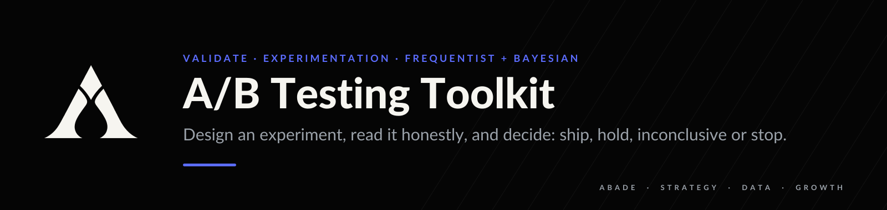
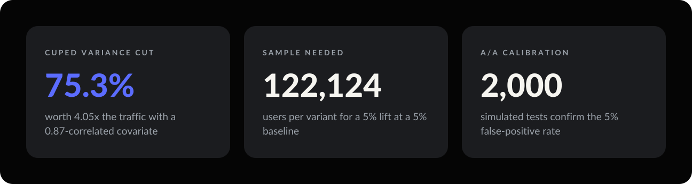
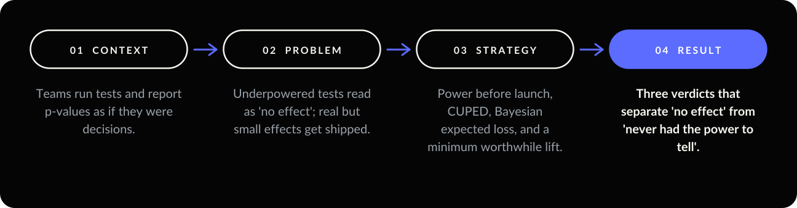
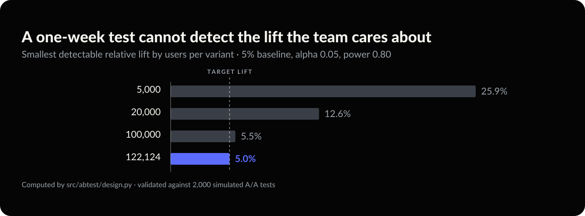

<p align="center"></p>

<p align="center">
  
  
  
  
</p>

**Most experiment failures are decision failures, not statistical ones.** This toolkit separates "we
tested and found nothing" from "we never had the power to find it". Those two readings lead to
opposite actions.

<p align="center"></p>

<p align="center"></p>

---

## 01 — Context

Teams run experiments and report a p-value as if it were the decision. The failures happen at three
moments: **before** the test (not enough traffic), **when reading it** (a p-value described as a
posterior probability) and **when deciding** (a significant effect too small to be worth shipping).

### Data

**No external dataset.** The question is not *what happened in some company's experiment* but *does
this implementation do the right arithmetic*. That can only be checked against a process whose truth
is known:

- The false-positive rate is validated with **2,000 simulated A/A tests**, landing within sampling
  error of the 5% alpha.
- CUPED's `theta` is validated against data generated with a known coefficient of 0.7.

---

## 02 — Problem

A 10% observed lift with p = 0.26 is routinely written up as "no difference". It is not: the test never
had the power to tell. A real 3% lift with 99% probability can still be the wrong thing to ship.
**Absence of a result is not evidence of no effect, and presence of one is not a reason to ship.**

---

## 03 — Strategy

| Decision | Why |
| --- | --- |
| **Frequentist and Bayesian side by side** | `p-value = P(data | no effect)` and `P(B beats A | data)` answer different questions. Every readout prints the distinction. |
| **Expected loss as the ship gate** | It is denominated in conversion rate given up, the thing the business cares about. |
| **Pooled variance for the test, unpooled for the interval** | Pooling assumes the null, which is right for testing it and wrong for estimating the effect. |
| **Minimum worthwhile lift is required** | `decide()` returns no verdict without one. |
| **CUPED covariate must be pre-experiment** | That is the only thing keeping the estimate unbiased. |

```
n per variant     = (z_α·sqrt(2p(1-p)) + z_β·sqrt(p0(1-p0) + p1(1-p1)))² / (p1 - p0)²
CUPED theta       = cov(metric, covariate) / var(covariate)
adjusted metric   = metric - theta * (covariate - mean(covariate))
variance multiple = 1 / (1 - variance_reduction)
expected loss     = E[max(control_rate - treatment_rate, 0)]
```

Sample size scales with `1 / mde²`: halving the effect you want to detect quadruples the traffic. A test
asserts that relationship.

---

## 04 — Result

<p align="center"></p>

**Design is where most tests are lost.** At a 5% baseline, detecting a 5% relative lift needs
**122,124 users per variant**. A team with 20,000 users a day that plans a one-week test can only
detect a **6.6%** lift, so a real 5% improvement would be recorded as "no effect".

**CUPED buys traffic you do not have.** A pre-experiment covariate correlated at 0.87 cuts variance by
**75.3%**, the equivalent of **4.05x** the users. A 12-day test becomes a 3-day one, with no added bias.

**Three verdicts, three failures avoided** ([`reports/example_readout.txt`](reports/example_readout.txt)):

| Scenario | p-value | P(treatment better) | Verdict |
| --- | --- | --- | --- |
| Clear win | 0.0002 | 100.0% | **SHIP** |
| Real effect, below the bar worth shipping for | — | 99.2% | **HOLD** |
| Promising number, never powered to answer | 0.2623 | 86.9% | **INCONCLUSIVE** |

> **Decision.** Do not launch a test without a power calculation and a minimum worthwhile lift. Read
> HOLD and INCONCLUSIVE as different instructions: *not worth it* and *not yet known*.

---

## 05 — Limits and next move

- **Binary outcomes only.** Revenue per user is heavy-tailed and needs different machinery.
- **No sequential testing.** Peeking at a fixed-horizon test inflates false positives.
- **No multiple-comparison correction.** Four variants at α = 0.05 give about a 19% chance of at least
  one false positive.
- **Independence is assumed.** Households, sessions and network effects shrink the true standard errors.
- **Beta(1,1) prior by choice.** A well-known baseline justifies a tighter prior.
- **Next move:** sequential testing with alpha spending, and revenue-per-user with a bootstrap interval.

---

## Run it

```bash
git clone https://github.com/arielabade/ab-testing-toolkit
cd ab-testing-toolkit
python -m venv .venv && source .venv/bin/activate
pip install -e ".[dev]"

python example_readout.py   # design, then three readouts
pytest                      # 15 tests, including 2,000 simulated A/A trials
```

```python
from abtest.design import sample_size_proportions
from abtest.report import decide, render

plan = sample_size_proportions(baseline_rate=0.05, mde_relative=0.05)
print(plan.per_variant, plan.days_required(daily_users=20_000))
print(render(decide(3_300, 66_000, 3_600, 66_000, minimum_worthwhile_lift=0.05)))
```

## Repository map

```
src/abtest/design.py    sample size, minimum detectable effect
src/abtest/analyse.py   two-proportion z-test, Beta-Binomial posteriors, expected loss
src/abtest/cuped.py     variance reduction with a pre-experiment covariate
src/abtest/report.py    ship / hold / inconclusive / stop, with the reason
tests/                  including simulation-based calibration of the test itself
notebooks/              experiment failure modes
```

---

<p align="center"></p>

<p align="center">
  <a href="https://github.com/arielabade/tracking-attribution-lab">← Trust the events first</a> &nbsp;·&nbsp;
  <a href="https://github.com/arielabade">Portfolio</a> &nbsp;·&nbsp;
  <a href="https://github.com/arielabade/marketing-mix-modeling">Attribute revenue to channels →</a>
</p>
